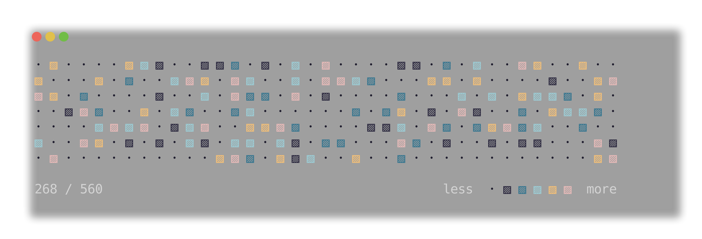
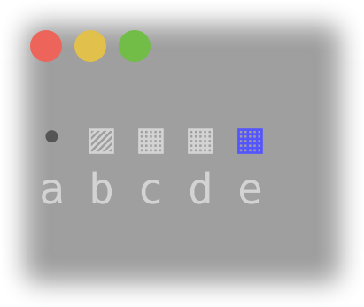
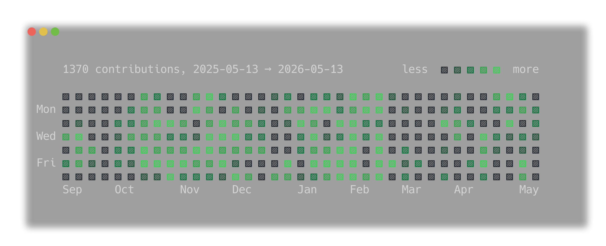
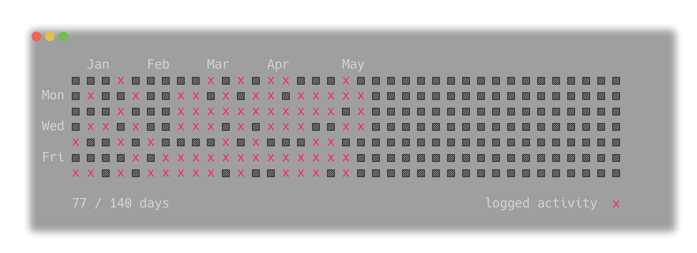
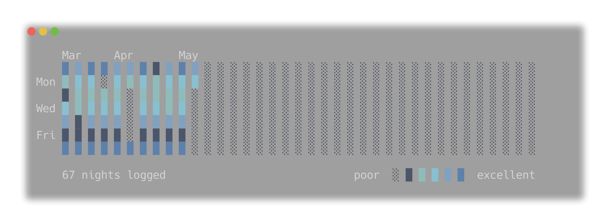
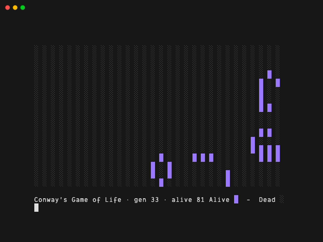

<div align='center'>
  <h1>heatgraph</h1>
  <p>A terminal heat-map renderer for people who actually like their terminal.</p>
</div>



## Overview

`heatgraph` is a lightweight, zero-dependency Python utility that turns
matrix-style data into ANSI heat-maps. It lives at the end of your unix pipe —
because why fire up a Jupyter notebook when you can grep some numbers and pipe
them into a beautiful grid of colored blocks?

- stdin → matrix data → colored ASCII heatmap
- zero runtime dependencies
- fast, composable, and script-friendly

## Quick start

If you have a JSON object with a `values` array, you're already halfway there:

```bash
echo '{"values":[[1,2,3,4,5]],"cols":["a","b","c","d","e"]}' | uvx heatgraph
```

<div align="center">
  
</div>

## Examples

**Visualize your GitHub contributions**

```bash
uvx heatgraph-helpers gh-contributions <username> --theme github-dark
```


**Track a workout routine**

```bash
uvx heatgraph-helpers habit-tracker examples/workout-log.md --simple
```


**Track your sleep quality**

```bash
uvx heatgraph-helpers habit-tracker examples/sleep.log \
  --theme nord --glyphs terminal --normalize quantile \
  --message '[COUNT] nights logged' \
  --legend 'poor  [GRADIENT]  excellent'
```



**Live data with `--follow`**

```bash
# Conway's Game of Life as the "live data"
uvx heatgraph-helpers game-of-life | uvx heatgraph --follow --glyphs terminal
```



## Features

- **Zero dependencies.** Pure Python 3.12+. No `pip install` nightmares.
- **Streaming.** `--follow` reads NDJSON and redraws frames in place — no
  scrollback flood.
- **Quantile binning.** `--normalize quantile` for the GitHub-contributions
  look: zero is its own bucket, the rest binned by quantile.
- **Gamma correction.** `--gamma` to fine-tune the pop of your colors.
- **Themes.** A curated collection so your heatgraphs don't look straight out
  of 1984. Unless that's the brief.

## Docs

| Doc                                            | When to read it                                                   |
|------------------------------------------------|-------------------------------------------------------------------|
| [docs/CONFIGURATION.md](docs/CONFIGURATION.md) | All CLI flags, precedence rules, where settings come from.        |
| [docs/CUSTOMIZING.md](docs/CUSTOMIZING.md)     | Themes, glyph presets, headers, building your own look.           |
| [docs/SCHEMA.md](docs/SCHEMA.md)               | The matrix-doc JSON contract and the streaming/NDJSON protocol.   |
| [docs/CONCEPTS.md](docs/CONCEPTS.md)           | Shared vocabulary — bucket, palette, glyph, direction, and friends. |

## License

GPLv3. Keep it free, keep it open, and for the love of god, don't wrap this in
a proprietary electron app.
