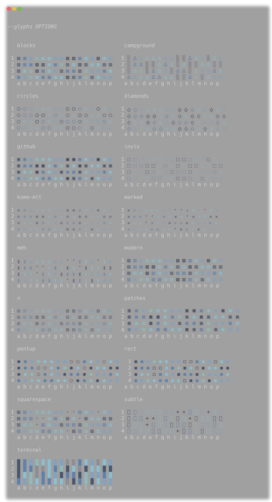

# Customizing `heatgraph`

`heatgraph` ships with sensible defaults so you don't *have* to customize
anything. But you probably will, because terminals are personal.

## Themes

A theme bundles a color palette, a glyph preset, and a handful of optional
render hints into a single JSON file. Pick one with `--theme <name>` or point
at any JSON file with `--theme ./mytheme.json`.

### Built-in themes

| Name                        | Vibe                                       |
|-----------------------------|--------------------------------------------|
| `default-dark`              | The thing you get if you don't pick one.   |
| `default-light`             | The thing you get on a light terminal.     |
| `github-dark`               | Contribution-graph nostalgia.              |
| `github-dark-high-contrast` | Same, louder.                              |
| `github-light`              | For folks who use light mode unironically. |
| `ghostty-default-dark`      | Ghostty's default palette, ported.         |
| `catppuccin-mocha`          | The internet's favorite.                   |
| `monokai`                   | TextMate 2004 forever.                     |
| `nord`                      | Cold, calm, blue.                          |
| `night-owl`                 | Sarah Drasner's classic.                   |
| `rose-pine`                 | Soft, mauve, classy.                       |
| `solarized-dark`            | Ethan Schoonover's eye-saver.              |
| `tokyo-night`               | The headline act.                          |
| `tokyo-night-storm`         | Slightly more dramatic.                    |
| `tokyo-night-moon`          | Slightly more chill.                       |
| `tokyo-night-day`           | The same idea, but daytime.                |

> TODO: theme preview screenshots at `images/themes/<name>.png`.

### Custom themes

A theme JSON file is small on purpose:

```json
{
  "colors": ["#161b22", "#0e4429", "#006d32", "#26a641", "#39d353"],
  "glyphs": "modern",
  "gamma": 0.8
}
```

| Key                  | Type                | Notes                                                                                                              |
|----------------------|---------------------|--------------------------------------------------------------------------------------------------------------------|
| `colors`             | `array<string>`     | Color specs from low to high. Each is `#RRGGBB`, `256:N` (xterm 256), or a raw ANSI escape.                        |
| `glyphs`             | `string` or `array` | Either a preset name (see below) or a JSON list of glyph strings, one per bucket.                                  |
| `gamma`              | number              | Applied during linear bucketing. Lower = more contrast at the low end.                                             |
| `normalize`          | string              | `"linear"` or `"quantile"`. Quantile = GitHub-style: zero is its own bucket, the rest binned by quantile.          |
| `direction`          | string              | `"ltr"` (default) or `"rtl"`. Which edge real data anchors to.                                                     |
| `pad_to_width`       | boolean             | Pad the row out to viewport width with zero cells.                                                                 |
| `invert_headers`     | boolean             | Column labels at the bottom (default true).                                                                        |
| `header_orientation` | string              | `auto` / `horizontal` / `vertical`.                                                                                |
| `row_labels`         | boolean             | Show row labels (default true).                                                                                    |
| `col_labels`         | boolean             | Show column labels (default true).                                                                                 |

Anything you don't set falls through to the built-in default. There is no
required field — even `colors` is optional if you only want to swap the glyph
preset.

To install: drop the file into `src/heatgraph/themes/<name>.json` to use it by
name, or keep it anywhere and pass the path to `--theme`. The path form is
nicer when you're iterating.

### Color spec formats

| Form            | Example               | Notes                                                                          |
|-----------------|-----------------------|--------------------------------------------------------------------------------|
| Hex truecolor   | `#39d353`             | The 24-bit happy path. Works on any modern terminal.                           |
| xterm 256       | `256:34`              | When you're stuck on a terminal that lies about supporting truecolor.          |
| Raw ANSI escape | `\x1b[32m` (ESC byte) | When you know exactly what you want and don't want us to second-guess you.    |

## Cell appearance

### Glyph presets

The glyph palette is one character (or escape-wrapped character) per bucket,
low to high. The shape of the palette matters more than the count — extras get
clamped to the last entry.

| Preset        | Glyphs (low → high) |
|---------------|---------------------|
| `blocks`      | `▧ ▧ ▧ ▦ ▦`         |
| `campground`  | `░ ░ ∆`             |
| `circles`     | `◯`                 |
| `diamonds`    | `ᚖ`                 |
| `github`      | `▣`                 |
| `invis`       | `⬚`                 |
| `kome-mit`    | `※`                 |
| `marked`      | `· 𐄂`               |
| `meh`         | `· ᚕ`               |
| `modern`      | `▨`                 |
| `n`           | `⊡`                 |
| `patches`     | `ᚙ`                 |
| `pentup`      | `⬡ ⬢`               |
| `rect`        | `◻ ◼`               |
| `square-x`    | `▨ x`               |
| `squarespace` | `· ▨`               |
| `subtle`      | `+ ✛`               |
| `terminal`    | `░ █`               |




A glyph list shorter than the color list is fine — the last glyph repeats.

### Custom glyphs

Pass a JSON list directly on the CLI:

```bash
echo '{"values":[[0,1,2,3,4]]}' | heatgraph --glyphs '["·","░","▒","▓","█"]'
```

Or set `glyphs` to a list in your theme JSON. Glyphs may be plain characters,
multi-character strings, or ANSI-wrapped escapes (e.g. dim/bold layered on the
theme color) if you want per-bucket effects.

### Spacers

`--spacer` is the character between cells. Default is a single space, which
keeps things readable. Set it to `""` for a dense grid:

```bash
echo '{"values":[[1,2,3,4,5]]}' | heatgraph --spacer ''
```

## Headers and labels

The actual flags live in [CONFIGURATION.md](CONFIGURATION.md#cli-flags). This
section is the *why* behind the defaults.

By default the column-label header sits *below* the grid (with the message and
legend on top), because reading bottom-to-top matches how a typical analyst
scans a time series: most recent on the right, label underneath. If you want
the classic top-down layout, pass `--no-invert-headers`.

Long labels collide. `--header-orientation auto` (the default) stacks them
vertically when that happens; force `horizontal` if you don't mind truncation
or `vertical` if you don't mind tall headers.

Turn either axis off entirely with `--no-row-labels` / `--no-col-labels` when
the data speaks for itself.
